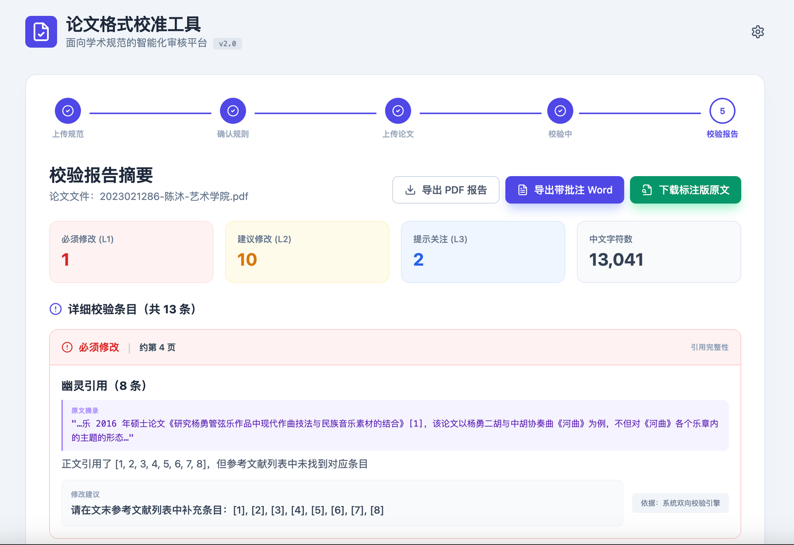

# 论文格式校准工具

> 这个工具是我为了自己的毕业论文检测而制作的，我觉得还不错，如果有朋友下载后发现任何可以优化的问题，记得发邮件给我哦

面向学术规范的智能化审核平台，帮助学生在提交前自查论文格式问题。


**在线体验：[https://thesis-format-checker.vercel.app](https://thesis-format-checker.vercel.app)**

---

## 界面预览

**Step 1 — 上传格式规范文件**


**Step 5 — 校验报告（含三级问题分类、幽灵引用定位、一键导出）**



---

## 更新日志

| 版本 | 更新内容 |
|------|---------|
| **v1.3** | 修复 PDF 批注中文乱码；步骤条支持点击回退（数据保留） |
| v1.2 | 支持导出带批注 PDF；PDF 批注定位至具体页面 |
| v1.1 | 导出带批注 Word；参考文献双向校验优化 |
| v1.0 | 初始版本发布 |

---

## 功能特性

### 真实文件解析（非模拟数据）

| 格式 | 解析能力 |
|------|---------|
| `.docx` | 完整解析：正文文本 + XML 样式树（字体、字号、行距均可读取）|
| `.doc` | 三重降级策略：mammoth → RTF 剥离 → OLE2 二进制扫描 |
| `.pdf` | pdf.js 逐页提取文字层（最多 20 页）|
| `.txt` / `.md` | 直接读取 |
| 图片 | Tesseract.js OCR 识别（用于扫描版规范文件）|

### 校验维度（8 大类）

#### A. 参考文献双向引用
- **幽灵引用**：正文引用了 `[n]` 但文末列表中没有该条目 → L1 必须修改
- **孤立条目**：列表中有条目但正文从未引用 → L2 建议修改
- 支持连续引用 `[1-5]`、逗号分隔 `[1,3,5]` 等多种格式

#### B. 中英文标点混用
- 检测中文句子中误用英文半角 `,` `;` `:` `!`
- 精确定位，前 8 条逐条给出原文摘录 + 页码，超出部分汇总提示
- 自动跳过参考文献条目行，避免误报

#### C. 字体排版（仅限 .docx）
- 正文字体 / 章标题字体：与规范值比对（含字体别名匹配，如"宋体"= SimSun = STSong）
- 正文字号 / 一级标题字号：支持中文字号名（小四、三号）与 pt 值相互换算
- 正文行距：从 DOCX 样式树中读取，与规范值对比

#### D. 参考文献格式
- 检测是否包含 GB/T 7714 要求的文献类型标识（`[J]`、`[M]`、`[D]`、`[C]` 等）

#### E. 论文结构完整性
- 必须包含：中文摘要、英文 Abstract、关键词 / Keywords、参考文献章节
- 缺失时按 L1 / L2 严重等级提示

#### F. 章节标题编号格式
- 检测一级标题是否混用"第X章"与"数字序号"与"Chapter X"等多种风格
- 仅对 .docx（已提取章节结构）有效

#### G. 图题 / 表题位置
- 统计全文图题（"图 X"）和表题（"表 X"）数量，提醒人工核查位置

#### H. 中文字数统计
- 自动统计全文 CJK 字符数（可选是否含参考文献）

---

### 三级问题分类

| 级别 | 含义 | 颜色 |
|------|------|------|
| **L1 必须修改** | 明确违反规范或结构缺失，提交前必须处理 | 红色 |
| **L2 建议修改** | 疑似问题或建议项，需人工判断 | 橙色 |
| **L3 提示关注** | 无法自动验证，需人工逐一确认 | 蓝色 |

### 报告导出
- **导出 PDF**：调用浏览器打印功能，生成可存档的 PDF 报告
- **导出带批注 Word**：生成 `.docx` 文件，每条问题附有位置、描述、修改建议和规范依据

---

## 使用流程

```
Step 1          Step 2              Step 3          Step 4
上传规范  ──→  确认解析规则  ──→  上传论文  ──→  查看报告
```

### Step 1：上传格式规范
上传你学校发布的论文格式规范文件，支持 PDF / Word / TXT / 图片（OCR）。
- 工具会自动提取字体、字号、行距、引用格式等规则
- 若无规范文件，可跳过，工具将使用内置默认基线继续

### Step 2：确认解析规则
检查工具解析出的规则列表，每一项均可手动修改。
- 来源标注"规范文件"（从你上传的文件中提取）或"默认基线"（内置值）
- 规则优先级：用户修正 > 规范文件解析 > 默认基线

**内置默认基线（无规范文件时使用）：**

| 字段 | 默认值 |
|------|--------|
| 正文字体 | 宋体 |
| 章标题字体 | 黑体 |
| 正文字号 | 小四（12pt）|
| 一级标题字号 | 三号（16pt）|
| 正文行距 | 1.5 倍 |
| 上页边距 | 2.5 cm |
| 左页边距 | 3.0 cm |
| 图题位置 | 图下方居中 |
| 表题位置 | 表上方居中 |
| 引用格式 | GB/T 7714 |
| 正文页码 | 阿拉伯数字 |

### Step 3：上传待校论文
上传你的论文文件（建议 `.docx`，可获得最完整的校验结果）。

> **精度说明**
> - `.docx` 格式：字体、字号、行距、章节结构均可自动检测
> - `.pdf` / `.doc` 格式：仅文本层可分析，排版参数无法自动提取，会给出 L3 提示
> - 扫描版 PDF：文字识别准确率受限，标点、字号判断可能有偏差

### Step 4：查看并导出报告
- 按 L1 → L2 → L3 顺序处理问题
- 每条问题附有：定位（页码 + 章节名）、问题描述、修改建议、规范依据
- 导出 Word 报告交给导师或留档

---

## 配置与运行

### 方式一：直接在线使用（推荐，零配置）

打开 **[https://thesis-format-checker.vercel.app](https://thesis-format-checker.vercel.app)** 即可使用，无需下载任何东西。

### 方式二：本地运行（无需 Node.js）

```bash
# 克隆仓库
git clone https://github.com/MukamC/thesis-format-checker.git
cd thesis-format-checker

# 直接用浏览器打开（部分浏览器有跨域限制，推荐用本地服务器）
open index.html

# 或用 Python 起一个简单服务器
python3 -m http.server 8080
# 浏览器访问 http://localhost:8080
```

### 方式三：自行部署

本项目是纯静态 HTML，可部署到任意静态托管平台：

```bash
# Vercel（已配置好）
npx vercel --prod

# 或直接拖拽 index.html 到 Netlify Drop
# https://app.netlify.com/drop
```

---

## 技术栈

本项目是**零依赖单文件应用**，所有库均通过 CDN 加载，无需构建步骤。

| 库 | 用途 | 版本 |
|----|------|------|
| React | UI 框架 | 18.2.0 |
| htm | 无编译 JSX 替代方案 | 3.1.1 |
| Tailwind CSS | 样式 | CDN |
| lucide-react | 图标 | 0.309.0 |
| pdf.js | PDF 文字层提取 | 3.11.174 |
| mammoth.js | Word 文档解析 | 1.6.0 |
| JSZip | DOCX XML 结构读取 | 3.10.1 |
| Tesseract.js | 图片 OCR 识别 | 5.x |

---

## 工程边界说明

- **公式校验**：仅检测编号格式（右对齐、连贯性），不校验公式内部数学逻辑
- **图片分辨率**：无法从文本层估算，需人工核查
- **页边距**：DOCX 中可读取但当前版本暂未纳入自动比对
- **扫描版 PDF**：OCR 准确率约 80~90%，字号/字体判断不可用
- **MathType 公式**：私有格式，部分内容可能无法定位

---

## License

MIT
